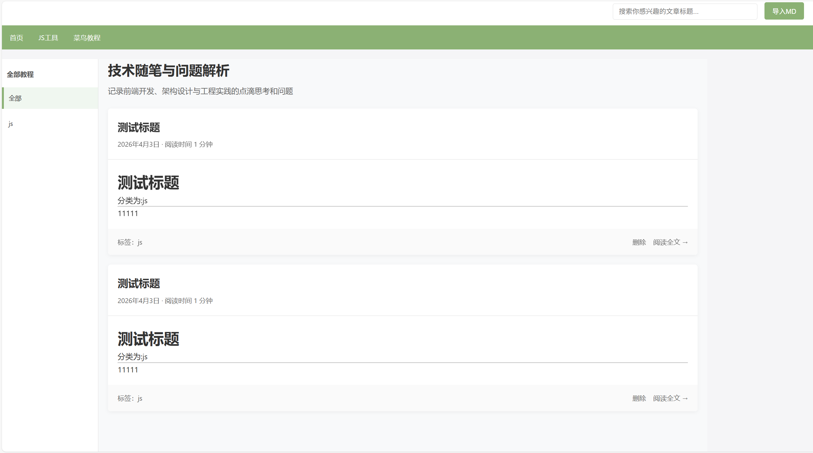
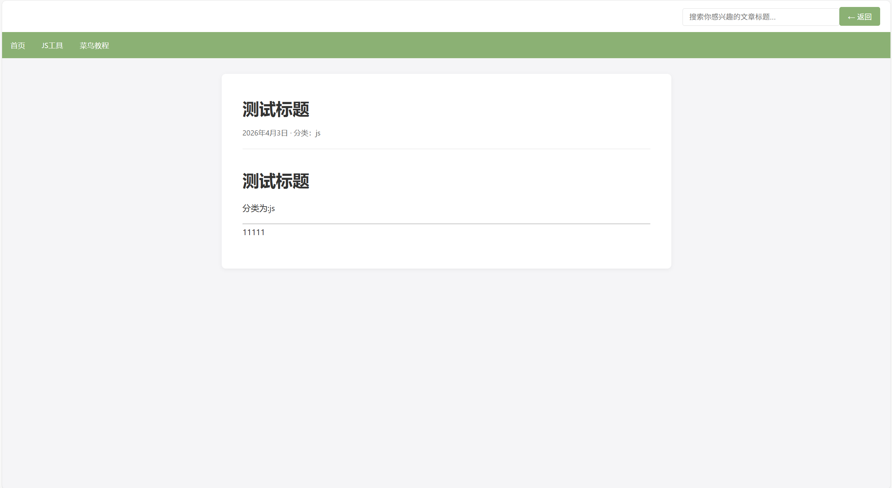

# 个人桌面技术博客

- 个人技术博客项目 Vue3+node.js+MongoDB 小白原创项目

---

一个基于本地数据库笔记管理,支持从桌面传入你的md文档笔记展示方便个人复习

- 你可以在md文档里面添加标题和分类,点击左侧目录可以展示你添加于此分类的笔记
  也支持按标题模糊查找你的笔记
- 可以在nar的中添加个人的常用网站
- 首页基本样式如图
  
  
  > 整个文件夹文件夹的名字->分类名,里面的md文档名字->标题名
  > 你可以在server\uploads\upload.js修改
  > 删除密码在"server\routes\posts.js"使用了correctPassword可以自己修改
  > 数据库连接在"server\config\database.js",也可以基于自己的配置自己修改

## 技术栈

- **前端**: Vue 3 + Vite
- **后端**: Node.js + Express
- **数据库**: MongoDB
- **HTTP客户端**: Axios

## 项目结构

```
PersonalBlog/
├── client/                 # Vue 前端
│   ├── src/
│   │   ├── App.vue        # 主页面组件
│   │   ├── main.js        # 入口文件
│   │   └── style.css     # 全局样式
│   ├── vite.config.js    # Vite 配置
│   └── package.json
│
└── server/                 # Express 后端
    ├── config/
    │   └── database.js   # MongoDB 连接配置
    ├── models/
    │   └── Post.js       # 文章数据模型
    ├── routes/
    │   └── posts.js      # 文章 API 路由
    ├── uploads/
    │   └── upload.js         # md文件上传
    ├── index.js          # 服务入口
    └── package.json
```

## 启动步骤

### 1. 启动 MongoDB 以及前后端~
