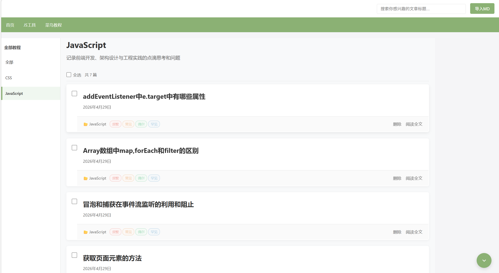
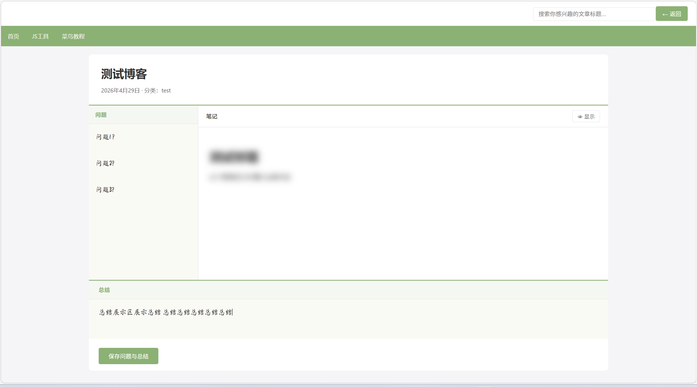
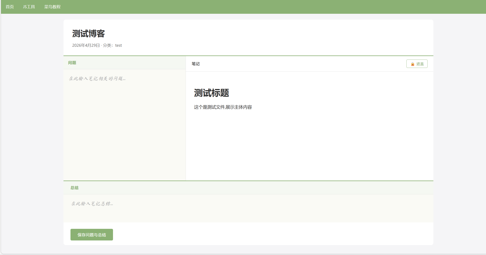
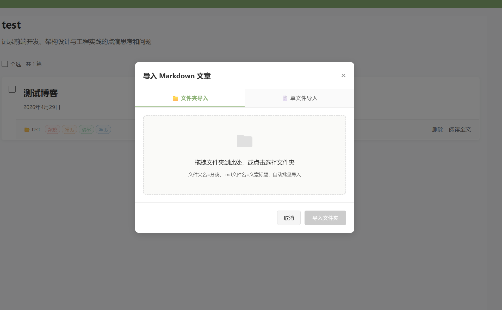
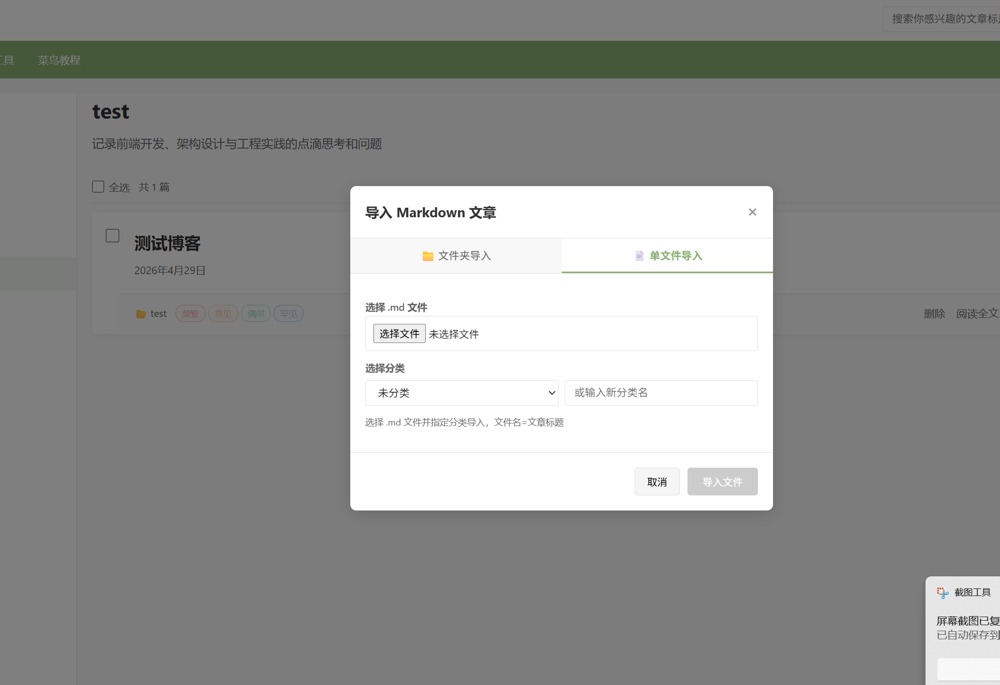
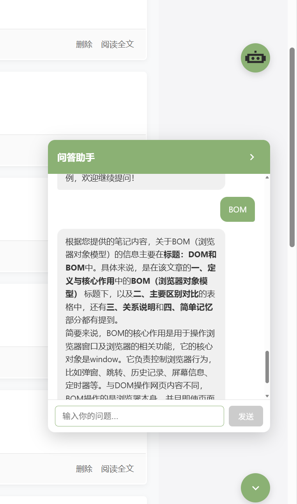
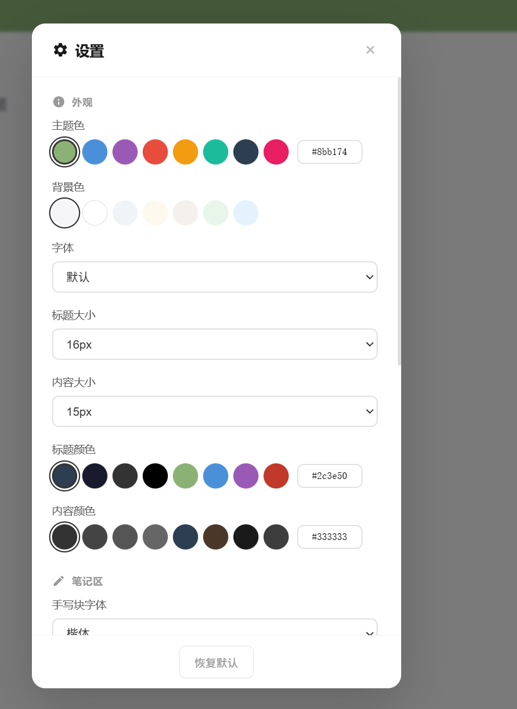

# PersonalNoteTable 个人桌面技术笔记

基于 Vue 3 + Express + nedb + Electron 的个人桌面技术笔记管理工具，采用康奈尔笔记法设计，支持 Markdown 笔记导入、RAG 智能问答、自定义主题。

> 已有 **Windows 发行版本**，下载即用 → [Releases](https://github.com/Rkgua/PersonalNoteTable/releases)

## 灵感来源

问 AI 技术问题后复盘困难，感觉编译器或者 IDE 都不好用，所以想自己写一个笔记管理工具。

## 功能特性

### 笔记管理
- **Markdown 导入**：支持文件夹批量导入和单文件自选分类导入
- **康奈尔三栏布局**：问题区 / 笔记区 / 总结区，中间分隔栏可拖拽调整宽度
- **主动回忆模式**：笔记内容可一键模糊，强制自己回忆后再查看原文
- **分类筛选**：按分类浏览笔记
- **标题搜索**：模糊搜索笔记标题和内容
- **难度标记**：频繁 / 常见 / 偶尔 / 罕见，辅助复习优先级
- **批量操作**：多选文件 → 移动分类 / 批量删除

### AI 智能问答
- 基于 **RAG（检索增强生成）**：先搜索笔记，再让 AI 基于你的数据回答
- 支持多模型：DeepSeek / OpenAI / Groq / Together AI / Anthropic Claude / 自定义
- 回答附带引用来源（分类 + 标题）

### 桌面特性
- **Electron 桌面封装**：Windows 安装包（~90MB），支持自动更新
- **本地数据存储**：nedb 嵌入式数据库，零外部依赖，数据存于本机
- **自定义主题**：主题色、背景色、字体、字号、手写块样式，实时生效
- **删除密码保护**：设置中可开关，开启后两步确认
- **快捷网站**：导航栏自定义常用网站链接

## 项目预览

### 主页


### 笔记展示



### 笔记导入



### AI 问答


### 设置面板


## 技术栈

| 层 | 技术 |
|----|------|
| 前端 | Vue 3 + Vite + Vue Router |
| 后端 | Node.js + Express 5 |
| 数据库 | `nedb`（纯 JavaScript 嵌入式文件数据库） |
| 桌面壳 | Electron 33 |
| 打包 | electron-builder（NSIS） |
| Markdown | markdown-it |
| HTTP 客户端 | Axios |
| 自动更新 | electron-updater |

## 项目结构

```
PersonalNoteTable/
├── client/                    # Vue 3 前端
│   ├── src/
│   │   ├── assets/           # SVG 图标、图片
│   │   ├── components/
│   │   │   ├── NavBar.vue    # 导航栏 + 设置面板
│   │   │   ├── QApanel.vue   # AI 问答机器人
│   │   │   └── BackToTop.vue # 回到顶部/底部
│   │   ├── views/
│   │   │   ├── Home.vue      # 首页（文章列表）
│   │   │   ├── PostDetail.vue# 文章详情（康奈尔布局）
│   │   │   └── NotFound.vue  # 404 页面
│   │   ├── store/
│   │   │   └── settings.js   # 设置状态（localStorage 持久化）
│   │   └── router/
│   │       └── index.js      # 路由配置
│   ├── index.html
│   ├── vite.config.js
│   └── package.json
│
├── server/                    # Express 后端
│   ├── models/
│   │   └── database.js       # nedb 数据库初始化
│   ├── routes/
│   │   ├── posts.js          # 文章 CRUD + 批量操作 API
│   │   └── qa.js             # AI 问答 RAG API
│   ├── uploads/
│   │   └── upload.js         # md 文件导入（单文件/文件夹）
│   ├── utils/
│   │   ├── asyncHandler.js   # 异步错误捕获
│   │   ├── AppError.js       # 自定义错误类
│   │   └── errorHandler.js   # 全局错误中间件
│   ├── index.js              # 服务入口
│   ├── .env.example          # 环境变量示例
│   └── package.json
│
├── electron/                  # Electron 桌面壳
│   ├── main.js               # 主进程（Express + 自动更新）
│   └── preload.js            # 预加载脚本
│
└── package.json               # 根配置（Electron 打包脚本）
```

## 开发运行

### 环境要求

- Node.js >= 18
- 无需安装数据库（nedb 自动创建文件）

### 启动步骤

```bash
# 1. 安装根目录依赖
npm install

# 2. 安装客户端依赖
cd client && npm install && cd ..

# 3. 启动前端开发服务器
npm run dev:client

# 4. 另一个终端，启动 Electron（开发模式）
npm run dev:electron
```

## 打包发布

```bash
# 1. 构建前端
npm run build

# 2. 打包 Windows 安装包
npm run pack

# 产物在 release/ 目录：
#   PersonalNoteTable Setup x.x.x.exe    -- NSIS 安装包
#   win-unpacked/                        -- 绿色免安装版
```

### 发布新版

```bash
# 1. 修改 package.json 版本号
# 2. 构建 + 打包
npm run build && npm run pack

# 3. 打标签推送
git tag v1.0.x
git push --tags
```

## 设置说明

| 配置项 | 说明 |
|--------|------|
| 删除密码 | 设置 → 删除保护 → 修改密码（默认 123456） |
| AI 密钥 | 设置 → AI 配置 → 选择提供商 → 填写 API Key |
| 主题样式 | 设置 → 外观 / 笔记区 → 实时预览更改 |

## 数据存储

所有数据存储在本地：

| 内容 | 位置 |
|------|------|
| 笔记数据库 | `%APPDATA%/personal-note-table/data/notes.db` |
| 设置 | 浏览器 localStorage（`pnt-settings` key） |
